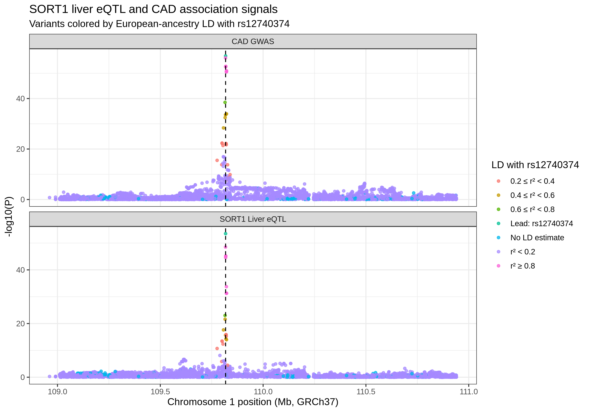
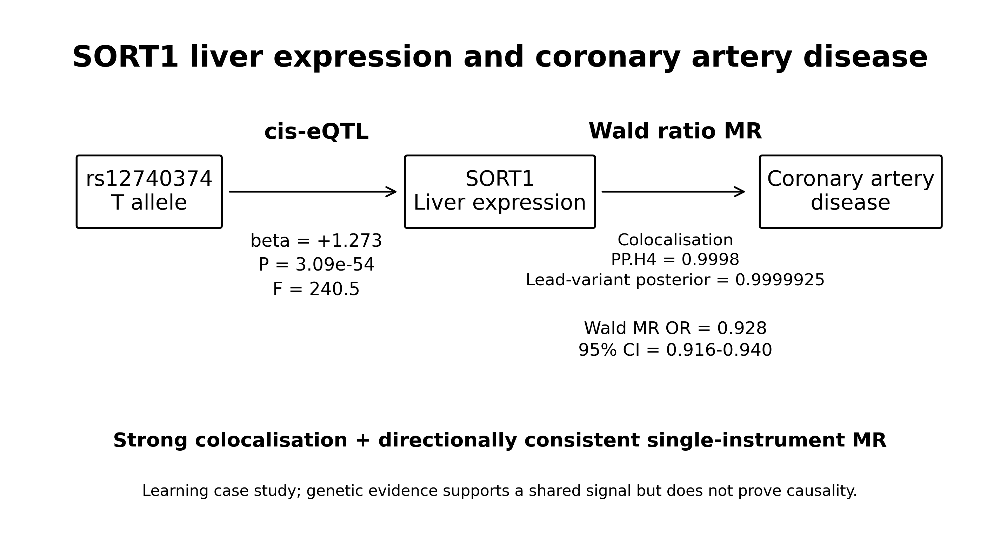

# SORT1–CAD Statistical Genetics Learning Project

> **Portfolio / learning project.** This repository documents a hands-on methods exercise using public summary statistics. It is intended to demonstrate workflow implementation and statistical-genetics reasoning, **not to claim a novel biological discovery**.

Using the well-characterised **SORT1–coronary artery disease (CAD)** locus as a case study, the project connects a regulatory variant, liver gene expression, and disease association through a compact **variant → gene → disease** workflow.

## What this project demonstrates

- GWAS and eQTL summary-statistics handling
- effect-allele harmonisation
- Bayesian colocalisation with `coloc`
- ancestry-matched LD estimation and LD clumping with PLINK2
- single-instrument Mendelian randomisation with the Wald ratio
- regional association and summary visualisation

## Research question

Can genetic evidence at the SORT1 locus connect:

**genetic variation → liver SORT1 expression → coronary artery disease risk?**

## Workflow

1. Extract SORT1 cis-eQTL summary statistics from GTEx v8 Liver.
2. Extract the corresponding SORT1 region from CAD GWAS summary statistics.
3. Harmonise genomic positions and effect-allele directions.
4. Perform Bayesian colocalisation.
5. Estimate LD using a 1000 Genomes Phase 3 European-ancestry reference panel.
6. Select independent strong cis-eQTL instruments using LD clumping.
7. Perform single-instrument Wald-ratio MR.
8. Generate regional association and summary figures.

## Data sources

Raw third-party datasets are **not redistributed in this repository**. See [`data/README.md`](data/README.md) for source links, expected local filenames, and input preparation.

### SORT1 expression

- Tissue: Liver
- Source: GTEx v8 cis-eQTL summary statistics distributed in SMR/BESD format
- Gene: `SORT1`
- Ensembl ID: `ENSG00000134243`
- Genome build: GRCh37/hg19
- In the analysis, SMR 1.4.2 was used to extract 5,661 SORT1 cis-eQTL records from the Liver BESD dataset.

### Coronary artery disease

- GWAS Catalog accession: `GCST90132314`
- Study: Aragam *et al.*, *Nature Genetics* (2022)
- Primary CAD GWAS: 181,522 cases among 1,165,690 participants, predominantly European ancestry
- Genome build used here: GRCh37

### LD reference panel

- 1000 Genomes Project Phase 3
- European-ancestry subset: 503 individuals
- Chromosome 1
- Used for LD estimation and instrument clumping

## Methods

### Allele harmonisation

eQTL and GWAS records were matched by chromosome and genomic position. Effect and non-effect alleles were checked explicitly.

Variants were classified as:

- `direct`: eQTL A1 matches the GWAS effect allele
- `swapped`: alleles are reversed and the GWAS beta sign is flipped
- `other`: incompatible allele definitions; excluded from strict analysis

Of **5,183** position-overlapping records, **5,167** passed strict allele harmonisation.

### Colocalisation

Bayesian colocalisation was performed with `coloc::coloc.abf()` using beta and standard-error estimates.

The key hypotheses are:

- **H3:** both traits are associated, but with different causal variants
- **H4:** both traits are associated and share a causal variant

For the quantitative GTEx eQTL trait, the analysis used `sdY = 1`, consistent with treating the normalized expression scale as standardized. For CAD, the case fraction was set to `181522 / 1165690` from the reported primary GWAS sample counts.

### LD analysis and instrument selection

Among **25** strong SORT1 cis-eQTL variants (`P < 5e-8`), **24** were available in the EUR LD reference panel.

LD clumping settings:

- `r² = 0.01`
- 10 Mb window

This left one independent instrument: **rs12740374**.

### Mendelian randomisation

Because only one independent instrument remained, the project used a **single-instrument Wald ratio** rather than multi-SNP IVW/MR-Egger methods.

The standard error was calculated with the delta method from the exposure and outcome beta/SE estimates.

## Results

### Lead variant: rs12740374

For the **T allele**:

**SORT1 liver eQTL**

- beta = **+1.27256**
- SE = **0.08206**
- P = **3.09e-54**
- F-statistic = **240.5**

**CAD GWAS**

- beta = **-0.09548**
- SE = **0.00597**
- P = **1.36e-57**
- OR per T allele ≈ **0.909**

### Colocalisation

Using **5,167** harmonised variants:

- PP.H4 = **0.999831**
- PP.H3 ≈ **0.000169**
- rs12740374 SNP.PP.H4 = **0.9999925**

Under the assumptions and default priors of the basic coloc model, this strongly supports a shared genetic signal between liver SORT1 expression and CAD association at this locus.

### Wald-ratio MR

- beta = **-0.0750**
- SE = **0.00674**
- OR = **0.928**
- 95% CI = **0.916–0.940**
- P = **8.55e-29**

The direction is consistent with **higher genetically predicted liver SORT1 expression being associated with lower CAD odds**.

This is not proof that experimentally increasing SORT1 expression will prevent CAD.

## Figures

### Regional association and LD



### Variant → gene → disease summary



## Limitations

- This is a **learning / portfolio case study**, not a discovery study.
- `coloc.abf()` in this analysis uses the basic single-causal-variant-per-trait assumption.
- The reported PP.H4 depends on the model priors; a formal prior-sensitivity analysis was not performed.
- The MR analysis uses only one independent instrument, so heterogeneity and horizontal pleiotropy cannot be assessed with standard multi-instrument diagnostics.
- GTEx eQTL effect sizes are on a normalized expression scale; their magnitude does not directly map to a simple biological fold-change.
- LD was estimated from a European-ancestry reference panel, so ancestry matching matters.
- Raw GTEx, CAD GWAS, and 1000 Genomes data remain subject to their original providers' terms and are not included here.

## Repository structure

```text
.
├── README.md
├── LICENSE
├── .gitignore
├── data/
│   └── README.md
├── docs/
│   └── analysis_notes.md
├── scripts/
│   ├── 00_prepare_inputs.sh
│   ├── 01_harmonise_summary_stats.R
│   ├── 02_colocalisation.R
│   ├── 03_select_instruments.R
│   ├── 04_ld_analysis_and_clumping.sh
│   ├── 05_wald_ratio.R
│   ├── 06_plot_locus_ld.R
│   └── 07_summary_figure.R
└── results/
    ├── summary/
    │   └── SORT1_CAD_summary.tsv
    └── figures/
        ├── SORT1_Liver_CAD_locus_LD.png
        └── SORT1_CAD_summary.png
```

> **Reproducibility note:** `00_prepare_inputs.sh`, `04_ld_analysis_and_clumping.sh`, and `05_wald_ratio.R` are reconstructed public versions based on the executed command history because the original one-off command blocks were not present in the uploaded review archive. See [`docs/analysis_notes.md`](docs/analysis_notes.md).

## Software used in the completed analysis

- R 4.4.3
- `data.table`
- `ggplot2`
- `coloc` 5.2.3
- PLINK2
- SMR 1.4.2

## Reuse

This repository is publicly viewable as a portfolio and educational demonstration. See [`LICENSE`](LICENSE) for reuse terms. Third-party datasets and software retain their own licences and terms of use.
